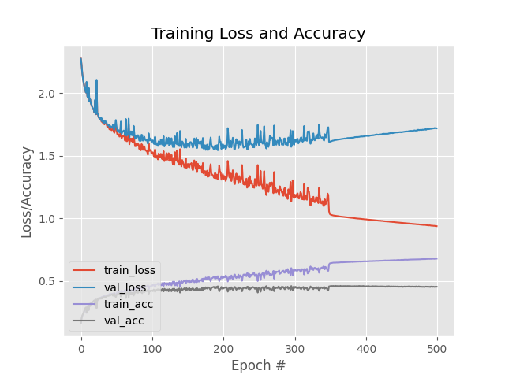

# Cultural Data Science - Visual Analytics Exam Portfolio

Luke Ring (202009983), exam: Visual Analytics, 10 May 2023

This portfolio comprises the readme files from the four assignments completed for the Visual Analytics module of the Cultural Data Science course at Aarhus University. The code for the portfolio and each assignment is available on github at [https://github.com/zeyus/cds-visual-exam](https://github.com/zeyus/cds-visual-exam) with subdirectories for each of the individual assignments:

- [Assignment 1 (https://github.com/zeyus/cds-visual-exam/tree/main/assignment_1)](https://github.com/zeyus/cds-visual-exam/tree/main/assignment_1)
- [Assignment 2 (https://github.com/zeyus/cds-visual-exam/tree/main/assignment_2)](https://github.com/zeyus/cds-visual-exam/tree/main/assignment_2)
- [Assignment 3 (https://github.com/zeyus/cds-visual-exam/tree/main/assignment_3)](https://github.com/zeyus/cds-visual-exam/tree/main/assignment_3)
- [Assignment 4 (https://github.com/zeyus/cds-visual-exam/tree/main/assignment_4)](https://github.com/zeyus/cds-visual-exam/tree/main/assignment_4)


# Assignment 1 - Image search algoritm

## Original Assignment Description

### Building a simple image search algorithm

For this assignment, you'll be using ```OpenCV``` to design a simple image search algorithm.

The dataset is a collection of over 1000 images of flowers, sampled from 17 different species. The dataset comes from the Visual Geometry Group at the University of Oxford, and full details of the data can be found [here](https://www.robots.ox.ac.uk/~vgg/data/flowers/17/).

For this exercise, you should write some code which does the following:

- Define a particular image that you want to work with
- For that image
  - Extract the colour histogram using ```OpenCV```
- Extract colour histograms for all of the **other* images in the data
- Compare the histogram of our chosen image to all of the other histograms 
  - For this, use the ```cv2.compareHist()``` function with the ```cv2.HISTCMP_CHISQR``` metric
- Find the five images which are most simlar to the target image
  - Save a CSV file to the folder called ```out```, showing the five most similar images and the distance metric:

|Filename|Distance]
|---|---|
|target|0.0|
|filename1|---|
|filename2|---|

#### Objective

This assignment is designed to test that you can:

1. Work with larger datasets of images
2. Extract structured information from image data using ```OpenCV```
3. Quantaitively compare images based on these features, performing *distant viewing*

#### Some notes
- You'll need to first ```unzip``` the flowers before you can use the data!

#### Additional comments

Your code should include functions that you have written wherever possible. Try to break your code down into smaller self-contained parts, rather than having it as one long set of instructions.

For this assignment, you are welcome to submit your code either as a Jupyter Notebook, or as ```.py``` script. If you do not know how to write ```.py``` scripts, don't worry - we're working towards that!

Lastly, you are welcome to edit this README file to contain whatever information you like. Remember - documentation is important!

# Assignment 1 - Luke Ring (202009983)

## Contribution

The code for this assignment was written independently and is my own (Luke Ring, 202009983) [zeyus @ github](https://github.com/zeyus).

## Setup

### Prerequisites

- Python 3.9+

### Python modules

Install requirements.

```bash
pip install -r requirements.txt
```

## Data

The data required is provided in the `data` folder.

## Usage

The script can be run from the command line.

```bash
python src/simple-image-search.py
```

Options can be specified for the script, details can be found by running

```bash
python src/simple-image-search.py --help
```

Output:

```txt
usage: simple-image-search.py [-h] [-t target] [-d data] [-o out] [-n num-similar] [-f file-extension]

Find similar images

options:
  -h, --help            show this help message and exit
  -t target, --target target
                        Target image (filename in data) (default: None)
  -d data, --data data  Path to image data (can be a zip file) (default: data)
  -o out, --out out     Path to output directory (default: out)
  -n num-similar, --num-similar num-similar
                        Number of similar images to return (default: 5)
  -f file-extension, --file-extension file-extension
                        File extension for images (e.g. jpg) (default: jpg)
```

## Results

The results of the script are saved to the `out` folder.

The script was run with the following arguments

```bash
python ./src/simple-image-search.py -t image_0014.jpg -d ./data/extracted/flowers
```

The source/target image was Image 0014: <br>


The results are saved to `out/similar_images.csv`:

```csv
filename,distance
data\extracted\flowers\image_0014.jpg,0.0
data\extracted\flowers\image_0048.jpg,1.9596926475958712e-05
data\extracted\flowers\image_0257.jpg,5.192197175874944
data\extracted\flowers\image_0404.jpg,5.901118988332068
data\extracted\flowers\image_0797.jpg,8.374330675901614
data\extracted\flowers\image_0791.jpg,11.812336294060142
```

The top 5 similar images found by the script are:

1. Image 0048: <br> 
2. Image 0257: <br> 
3. Image 0404: <br> 
4. Image 0797: <br> 
5. Image 0791: <br> 

Interestingly enough, the top result (with an extremely low distance) is basically the same image. Although they look visually identical, the files are different. I was concerned there was a mistake but I compared the file hashes from the two images and they are different.

```csv
filename,hash (SHA256)
image_0014.jpg,79F7AD9E98AD70739B318ED7E9C29485D49BA8862539FE31D87806AD8DF45136
image_0048.jpg,80E08E30AEAC16638DCD5FABE36E7873B27D1FAA14A0E6643E48F2668CC242AB
```

In general the results are not great, while it did successfully identify the image that is almost identical, the other results are not so similar from a human perspective, I intentionally picked a yellow daffodil because there were other daffodils and yellow flowers (e.g. sunflowers). It highlights the difficulty of quantifying human visual perception, as we use a lot of context and other information to identify similar images, and it also depends on what we mean by similar, e.g. emotional response, flower species, image colors, flower color, etc.

# Assignment 2 - Classification benchmarks with Logistic Regression and Neural Networks

## Original Assignment Description

For this assignment, we'll be writing scripts which classify the ```Cifar10``` dataset.

You should write code which does the following:

- Load the Cifar10 dataset
- Preprocess the data (e.g. greyscale, reshape)
- Train a classifier on the data
- Save a classification report

You should write one script which does this for a logistic regression classifier **and** one which does it for a neural network classifier. In both cases, you should use the machine learning tools available via ```scikit-learn```.

### Tips

- You should structure your project by having scripts saved in a folder called ```src```, and have a folder called ```out``` where you save the classification reports.
- Consider using some of the things we've seen in class, such as virtual environments and setup scripts.

### Purpose

- To ensure that you can use ```scikit-learn``` to build simple benchmark classifiers on image classification data
- To demonstrate that you can build reproducible pipelines for machine learning projects
- To make sure that you can structure repos appropriately

# Assignment 2 - Luke Ring (202009983)

## Contribution

The code for this assignment was written independently and is my own (Luke Ring, 202009983) [zeyus @ github](https://github.com/zeyus).

## Setup

### Prerequisites

- Python 3.9+

### Python modules

Install requirements.

```bash
pip install -r requirements.txt
```

## Data

The data is downloaded from the [Cifar10](https://www.cs.toronto.edu/~kriz/cifar.html) website and saved to `data/` by default, unless the `--no-download` flag is passed to the script.

## Usage

The script can be run from the command line.

```bash
python src/cifar10classifier.py
```

Options can be specified for the script, details can be found by running

```bash
python src/cifar10classifier.py --help
```

Output:

```txt
usage: cifar10classifier.py [-h] [--version] [-m MODEL_SAVE_PATH] [--no-download] [--force] [-d DATASET_PATH] [-b BATCH_SIZE] [-e EPOCHS] [-n] [-o OUT]

Text classification CLI

optional arguments:
  -h, --help            show this help message and exit
  --version             show program's version number and exit
  -m MODEL_SAVE_PATH, --model-save-path MODEL_SAVE_PATH
                        Path to save the trained model(s) (default: models)
  --no-download         Do not attempt to download the CIFAR10 dataset (default: False)
  --force               Force download of the CIFAR10 dataset (default: False)
  -d DATASET_PATH, --dataset-path DATASET_PATH
                        Path to the dataset (default: data)
  -b BATCH_SIZE, --batch-size BATCH_SIZE
                        The batch size (default: 256)
  -e EPOCHS, --epochs EPOCHS
                        The number of epochs (default: 150)
  -n, --neural-network  Use a neural network model, otherwise use logistic regression (default: False)
  -o OUT, --out OUT     The output path for the plots and stats (default: out)
```

## Results

The results of the script are saved to the `out` folder.

The script was run with the following arguments

```bash
python src/cifar10classifier.py -b 256 -e 500 -n
```

Output:

```txt
              precision    recall  f1-score   support

    airplane       0.51      0.51      0.51      1000
  automobile       0.53      0.51      0.52      1000
        bird       0.35      0.35      0.35      1000
         cat       0.30      0.28      0.29      1000
        deer       0.39      0.38      0.39      1000
         dog       0.39      0.39      0.39      1000
        frog       0.48      0.51      0.49      1000
       horse       0.53      0.54      0.53      1000
        ship       0.54      0.56      0.55      1000
       truck       0.50      0.53      0.51      1000

    accuracy                           0.46     10000
   macro avg       0.45      0.46      0.45     10000
weighted avg       0.45      0.46      0.45     10000
```



As can be seen, the payoff from training for more epochs is not always worth it. The neural network model was trained for 500 epochs, but the accuraccy and loss did not improve much after around 150 epochs.

For comparison, an Logistic Regression model was also trained for 500 epochs with the following results:

```txt
              precision    recall  f1-score   support

    airplane       0.34      0.37      0.36      1000
  automobile       0.33      0.35      0.34      1000
        bird       0.23      0.20      0.21      1000
         cat       0.20      0.16      0.18      1000
        deer       0.22      0.19      0.20      1000
         dog       0.27      0.27      0.27      1000
        frog       0.26      0.28      0.27      1000
       horse       0.28      0.27      0.28      1000
        ship       0.34      0.39      0.36      1000
       truck       0.37      0.42      0.39      1000

    accuracy                           0.29     10000
   macro avg       0.28      0.29      0.29     10000
weighted avg       0.28      0.29      0.29     10000
```

While the neural network model performed much better, neither had a very high F1 score. It's possible that a more complex neural network model would perform better, although just increasing the hidden layer sizes of the MLPClassifier did not significantly increase the model's performance, most likely due to overfitting.


# Assignment 3 - Using pretrained CNNs for image classification

## Original Assignment Description

In the previous assignments involving classification, we were performing a kind of simple feature extraction on images by making them greyscale and flattening them to a single vector. This vector of pixel values was then used as the input for some kind of classification model.

For this assignment, we're going to be working with an interesting kind of cultural phenomenon - fashion. On UCloud, you have access to a dataset of *Indo fashion* taken from this [Kaggle dataset](https://www.kaggle.com/datasets/validmodel/indo-fashion-dataset). There is a paper which goes along with it on *arXiv.org*, which you can read [here](https://arxiv.org/abs/2104.02830).

Your instructions for this assignment are short and simple:

- You should write code which trains a classifier on this dataset using a *pretrained CNN like VGG16*
- Save the training and validation history plots
- Save the classification report

### Tips

- You should not upload the data to your repo - it's around 3GB in size.
  - Instead, you should document in the README file where your data comes from, how a user should find it, and where it should be saved in order for your code to work correctly.
- The data comes already split into training, test, and validation datasets. You can use these in a ```TensorFlow``` data generator pipeline like we saw in class this week - you can see an example of that [here](https://stackoverflow.com/questions/42443936/keras-split-train-test-set-when-using-imagedatagenerator).
- There are a lot of images, around 106k in total. Make sure to reserve enough time for running your code!
- The image labels are in the metadata folder, stored as JSON files. These can be read into ```pandas``` using ```read_json()```. You can find the documentation for that online.


# Assignment 3 - Luke Ring (202009983)

## Contribution

The code for this assignment was written independently and is my own (Luke Ring, 202009983) [zeyus @ github](https://github.com/zeyus).

## Description

This repository contains code that fine tunes a VGG16 model on the Indo Fashion dataset. The training history plot, confusion matrix and classification report are saved in the `out/` folder, along with a csv file containing the training history, and a txt file containing the model summary and classification report.

The data were preprocessed using the following steps:

- Proportionally rescaled the images to `IMAGE_SIZE`x`IMAGE_SIZE` pixels, or `IMAGE_WIDTH`x`IMAGE_HEIGHT` pixels if specified.
- Images were zero-padded to match the input size of the model, with the image centered.
- Normalized the pixel values to be between 0 and 1.
- For training data, random horizontal flips were and random rotations of -20 to 20 percent were applied.

For the results below, the images were resized to 100x200 pixels, and the batch size was 256.

## Setup

### Windows GPU (optional)

If you have an NVIDIA GPU you can do the following before installing the prerequisites:

- Install [Anaconda](https://www.anaconda.com/products/individual)
- Create a new environment using `conda create -n vgg16 python=3.9`
- Activate the environment using `conda activate vgg16`
- Install cudatoolkit and cudnn with `conda install -c conda-forge cudatoolkit=11.2 cudnn=8.1.0`

### Prerequisites

- Install the required packages using `pip install -r requirements.txt`
- Download the dataset from [Kaggle](https://www.kaggle.com/datasets/validmodel/indo-fashion-dataset), unzip and save it to `data/` either manually, or by doing the following:
  - Get your kaggle API token from [here](https://www.kaggle.com/settings) and save it to `~/.kaggle/kaggle.json`
  - Run `python src/cnn.py --download` to download the dataset

## Usage

- Run `python src/cnn.py` to train the model with the default parameters.

Most settings can be customized, such as input resizing, batch size, number of epochs, etc. Run `python src/cnn.py --help` to see all the available options.

```txt
❯ python .\src\cnn.py --help
usage: cnn.py [-h] [--version] [-m MODEL_SAVE_PATH] [--download] [-d DATASET_PATH] [-s IMAGE_SIZE] [-w IMAGE_WIDTH] [-t IMAGE_HEIGHT] [-b BATCH_SIZE] [-e EPOCHS] [-o OUT] [-n] [-c FROM_CHECKPOINT] [-r] [-p PARALLEL]

Text classification CLI

optional arguments:
  -h, --help            show this help message and exit
  --version             show program's version number and exit
  -m MODEL_SAVE_PATH, --model-save-path MODEL_SAVE_PATH
                        Path to save the trained model(s) (default: models)
  --download            Download the dataset from kaggle (default: False)
  -d DATASET_PATH, --dataset-path DATASET_PATH
                        Path to the dataset (default: data)
  -s IMAGE_SIZE, --image-size IMAGE_SIZE
                        The image size (width and height) (default: 32)
  -b BATCH_SIZE, --batch-size BATCH_SIZE
                        The batch size (default: 32)
  -e EPOCHS, --epochs EPOCHS
                        The number of epochs (default: 10)
  -o OUT, --out OUT     The output path for the plots and stats (default: out)
  -n, --no-train        Do not train the model (default: False)
  -c FROM_CHECKPOINT, --from-checkpoint FROM_CHECKPOINT
                        Use the checkpoint at the given path (default: None)
  -r, --resnet          Use ResNet50 as the base model. (default: False)
  -p PARALLEL, --parallel PARALLEL
                        Number of workers/threads for processing. (default: 4)
```

# Results

The final VGG16 model was trained in two steps, with a bach size of 256 and 150 epochs each.

The classification report, model history and confusion matrix are described below.

## First training step

### Classification report

```bash
precision    recall  f1-score   support

              blouse       0.93      0.89      0.91       500
         dhoti_pants       0.84      0.50      0.63       500
            dupattas       0.74      0.54      0.62       500
               gowns       0.71      0.45      0.55       500
           kurta_men       0.67      0.81      0.73       500
leggings_and_salwars       0.59      0.74      0.66       500
             lehenga       0.86      0.78      0.82       500
         mojaris_men       0.86      0.84      0.85       500
       mojaris_women       0.84      0.86      0.85       500
       nehru_jackets       0.90      0.81      0.85       500
            palazzos       0.88      0.63      0.74       500
          petticoats       0.64      0.86      0.73       500
               saree       0.60      0.91      0.72       500
           sherwanis       0.84      0.70      0.76       500
         women_kurta       0.53      0.74      0.62       500

            accuracy                           0.74      7500
           macro avg       0.76      0.74      0.74      7500
        weighted avg       0.76      0.74      0.74      7500
```

### Model history


### Confusion matrix


## Second training step

### Classification report

```bash
precision    recall  f1-score   support

              blouse       0.90      0.94      0.92       500
         dhoti_pants       0.85      0.55      0.67       500
            dupattas       0.79      0.47      0.59       500
               gowns       0.69      0.41      0.52       500
           kurta_men       0.66      0.87      0.75       500
leggings_and_salwars       0.66      0.75      0.70       500
             lehenga       0.90      0.81      0.86       500
         mojaris_men       0.89      0.79      0.84       500
       mojaris_women       0.81      0.90      0.85       500
       nehru_jackets       0.90      0.80      0.85       500
            palazzos       0.89      0.68      0.77       500
          petticoats       0.75      0.83      0.79       500
               saree       0.71      0.91      0.80       500
           sherwanis       0.87      0.68      0.77       500
         women_kurta       0.45      0.88      0.60       500

            accuracy                           0.75      7500
           macro avg       0.78      0.75      0.75      7500
        weighted avg       0.78      0.75      0.75      7500
```

### Model history


### Confusion matrix


# Conclusion

The model was able to achieve an accuracy of 75% on the test set, which is not bad, but it could have been better. 
Notably, something must have gone wrong with the training continuation, although the fine-tuned model was loaded correctly, the model training did not seem to continue, but given more epochs it's possible that the accuracy could have been further improved.

# Assignment 4 - Fine tuned VGG CNN Comparison

## Contribution

The code for this assignment was written independently and is my own (Luke Ring, 202009983) [zeyus @ github](https://github.com/zeyus).

## Description

This assignment is the final, self assigned project for the Cultural Data Science, Visual Analytics course at Aarhus University.

This project compares the classification performance of VGG networks fine tuned on the [YIKES! Spiders](https://www.kaggle.com/datasets/gpiosenka/yikes-spiders-15-species) dataset. This was of particular interest to me because there are many species of insects in general, and identifying species is difficult for untrained eyes. A recent article from phys.org describes over 100 new species of insects found in Norway alone in 2022 ([https://phys.org/news/2023-02-species-insects-norway.html](https://phys.org/news/2023-02-species-insects-norway.html)). This is a great example of how machine learning can be used to help identify species, and possibly adapted to identify new species from photos. Further potential applications could be for identifying harmless vs dangerous species in an application, and providing educational information about a particular insect. Although there are larger datasets with insects, the ones that I found that were available for use only contained labels for the insect family, not the species. This dataset was chosen because it contains labels for the species.

The dataset contains 2186 training images with 75 test images and 75 validation images with 15 different spider species. This project uses PyTorch, as opposed to the previous assignments that used TensorFlow. This was try implementing a neural network using a different framework.

## Setup

## Prerequisites

- Python 3.11

## Python modules

Install requirements.

```bash
pip install -r requirements.txt
```

## Data

Download the data from [https://www.kaggle.com/datasets/gpiosenka/yikes-spiders-15-species](https://www.kaggle.com/datasets/gpiosenka/yikes-spiders-15-species) and extract it to `data/`.

## Usage

The script can be run from the command line.

```bash
python src/eek.py
```

Options can be specified for the script, details can be found by running

```bash
python src/eek.py --help
```

Output:

```txt
usage: eek.py [-h] [--version] [-m MODEL_SAVE_PATH] [-o OUTPUT_PATH] [--download] [-d DATASET_PATH] [-e EPOCHS] [-n NET_NAME] [-b BATCH_SIZE] [-t] [-w WEIGHTS] [-V] [-i IMAGE_PATH] [-r ROTATION]

Text classification CLI

options:
  -h, --help            show this help message and exit
  --version             show program's version number and exit
  -m MODEL_SAVE_PATH, --model-save-path MODEL_SAVE_PATH
                        Path to save the trained model(s) (default: models)
  -o OUTPUT_PATH, --output-path OUTPUT_PATH
                        Path to save the output, figures, stats, etc. (default: out)
  --download            Download the dataset from kaggle (default: False)
  -d DATASET_PATH, --dataset-path DATASET_PATH
                        Path to the dataset (default: data)
  -e EPOCHS, --epochs EPOCHS
                        Number of epochs (default: 100)
  -n NET_NAME, --net-name NET_NAME
                        Name of the network to use (e.g. vgg19) (default: vgg19)
  -b BATCH_SIZE, --batch-size BATCH_SIZE
                        Batch size (default: 32)
  -t, --test-best-models
                        Test the best models (default: False)
  -w WEIGHTS, --weights WEIGHTS
                        Path to the weights file (.pth) (default: None)
  -V, --visualize       Visualize the model (activation maximization) (default: False)
  -i IMAGE_PATH, --image-path IMAGE_PATH
                        Predict the class for a single input image (default: None)
  -r ROTATION, --rotation ROTATION
                        Random rotation angle (degrees) for the input image (default: 90)
```

The weights from the best model for any run is saved in the `models` (or `MODEL_SAVE_PATH`) directory as a `.pth`file.

#### Reporting

Additionally, this script makes use of tensorboard (installed with the requirements), which allows monitoring of the script's progress. To use tensorboard, run the following command in the root directory of the project in a different shell instance:

```bash
tensorboard --logdir=out/runs
```

This provides a nice UI for the training progress and allows comparison between different training runs.

## Results

Although many different parameters were tried during the training and configuration, the final models used the following options:

- Epochs: 100
- Batch size: 150
- Training image random rotation angle: 45 degrees

The models used the AdamW optimizer with a learning rate of 0.001, and the CrossEntropyLoss function. The models were trained on a NVIDIA GeForce GTX 1070 GPU.

The training was invoked using the following command:

```bash
python ./src/eek.py -e 100 -n <vggnet> -b 150 -r 45
```

Where `<vggnet>` is the name of the VGG network to use. The following networks were used:
- vgg11
- vgg13
- vgg16
- vgg19

Subsequently, the best model of each network was run against the test set using the following command:

```bash
python ./src/eek.py -t
```

### Training

The training results for each network can be seen in the following figures:

Model Legend:


Validation Accuracy


Validation Loss


Interestingly enough, most models are extremely good even after the first epoch, and gains from further training are minimal. The vgg11 model seems to be the best performing model, with the highest validation accuracy and lowest validation loss.

### Testing

On the test data the models performed as follows:

| Model | Accuracy | Loss |
| --- | --- | --- |
| vgg11 | 0.9467 | 0.5871 |
| vgg13 | 0.9067 | 0.4135 |
| vgg16 | 0.9067 | 0.5502 |
| vgg19 | 0.9067 | 0.3621 |

The vgg11 model performed the best on the test data as well, with an accuracy of 0.9467 and a loss of 0.5871. The vgg13, vgg16 and vgg19 models all performed similarly, with an accuracy of 0.9067 and a loss of 0.4135, 0.5502 and 0.3621 respectively.

### Visualizing the model

The following images show the activation maximization of the vgg11 model for the different classes. The images were generated using the following command:

```bash
python ./src/eek.py -V -w <best_model_path> -n <model> -r <rotation>
```

Where `<best_model_path>` is the path to the best model weights, `<model>` is the name of the model to use, and `<rotation>` is the random rotation angle to use for the input image.

Some examples were generated for the vgg16 model and can be seen here:

Black widow:


Ladybird mimic spider:


## Conclusion

While the models all performed extremely well with limited training, a larger dataset would definitely improve the ability to classify spiders, especially as many look quite similar and only have minor differences between species. Additionally, the random rotation was important in ensuring a high classification accuracy, without it, the models overfit the training data very quickly. Using vgg networks as a base for insect classification seems promising, and could be further improved by using a larger dataset and more training time.