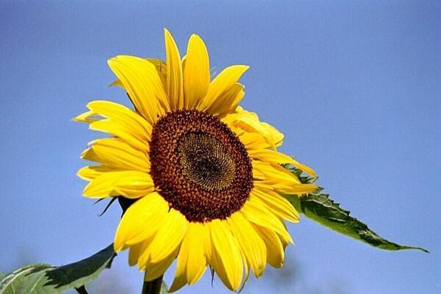

# Assignment 1 - Image search algoritm

## Original Assignment Description

### Building a simple image search algorithm

For this assignment, you'll be using ```OpenCV``` to design a simple image search algorithm.

The dataset is a collection of over 1000 images of flowers, sampled from 17 different species. The dataset comes from the Visual Geometry Group at the University of Oxford, and full details of the data can be found [here](https://www.robots.ox.ac.uk/~vgg/data/flowers/17/).

For this exercise, you should write some code which does the following:

- Define a particular image that you want to work with
- For that image
  - Extract the colour histogram using ```OpenCV```
- Extract colour histograms for all of the **other* images in the data
- Compare the histogram of our chosen image to all of the other histograms 
  - For this, use the ```cv2.compareHist()``` function with the ```cv2.HISTCMP_CHISQR``` metric
- Find the five images which are most simlar to the target image
  - Save a CSV file to the folder called ```out```, showing the five most similar images and the distance metric:

|Filename|Distance]
|---|---|
|target|0.0|
|filename1|---|
|filename2|---|

#### Objective

This assignment is designed to test that you can:

1. Work with larger datasets of images
2. Extract structured information from image data using ```OpenCV```
3. Quantaitively compare images based on these features, performing *distant viewing*

#### Some notes
- You'll need to first ```unzip``` the flowers before you can use the data!

#### Additional comments

Your code should include functions that you have written wherever possible. Try to break your code down into smaller self-contained parts, rather than having it as one long set of instructions.

For this assignment, you are welcome to submit your code either as a Jupyter Notebook, or as ```.py``` script. If you do not know how to write ```.py``` scripts, don't worry - we're working towards that!

Lastly, you are welcome to edit this README file to contain whatever information you like. Remember - documentation is important!

# Assignment 1 - Luke Ring (202009983)

## Contribution

The code for this assignment was written independently and is my own (Luke Ring, 202009983) [zeyus @ github](https://github.com/zeyus).

## Setup

### Prerequisites

- Python 3.9+

### Python modules

Install requirements.

```bash
pip install -r requirements.txt
```

## Data

The data required is provided in the `data` folder.

## Usage

The script can be run from the command line.

```bash
python src/simple-image-search.py
```

Options can be specified for the script, details can be found by running

```bash
python src/simple-image-search.py --help
```

Output:

```txt
usage: simple-image-search.py [-h] [-t target] [-d data] [-o out] [-n num-similar] [-f file-extension]

Find similar images

options:
  -h, --help            show this help message and exit
  -t target, --target target
                        Target image (filename in data) (default: None)
  -d data, --data data  Path to image data (can be a zip file) (default: data)
  -o out, --out out     Path to output directory (default: out)
  -n num-similar, --num-similar num-similar
                        Number of similar images to return (default: 5)
  -f file-extension, --file-extension file-extension
                        File extension for images (e.g. jpg) (default: jpg)
```

## Results

The results of the script are saved to the `out` folder.

The script was run with the following arguments

```bash
python ./src/simple-image-search.py -t image_0014.jpg -d ./data/extracted/flowers
```

The source/target image was Image 0014: <br>


The results are saved to `out/similar_images.csv`:

```csv
filename,distance
data\extracted\flowers\image_0014.jpg,0.0
data\extracted\flowers\image_0048.jpg,1.9596926475958712e-05
data\extracted\flowers\image_0257.jpg,5.192197175874944
data\extracted\flowers\image_0404.jpg,5.901118988332068
data\extracted\flowers\image_0797.jpg,8.374330675901614
data\extracted\flowers\image_0791.jpg,11.812336294060142
```

The top 5 similar images found by the script are:

1. Image 0048: <br> 
2. Image 0257: <br> 
3. Image 0404: <br> 
4. Image 0797: <br> 
5. Image 0791: <br> 

Interestingly enough, the top result (with an extremely low distance) is basically the same image. Although they look visually identical, the files are different. I was concerned there was a mistake but I compared the file hashes from the two images and they are different.

```csv
filename,hash (SHA256)
image_0014.jpg,79F7AD9E98AD70739B318ED7E9C29485D49BA8862539FE31D87806AD8DF45136
image_0048.jpg,80E08E30AEAC16638DCD5FABE36E7873B27D1FAA14A0E6643E48F2668CC242AB
```

In general the results are not great, while it did successfully identify the image that is almost identical, the other results are not so similar from a human perspective, I intentionally picked a yellow daffodil because there were other daffodils and yellow flowers (e.g. sunflowers). It highlights the difficulty of quantifying human visual perception, as we use a lot of context and other information to identify similar images, and it also depends on what we mean by similar, e.g. emotional response, flower species, image colors, flower color, etc.