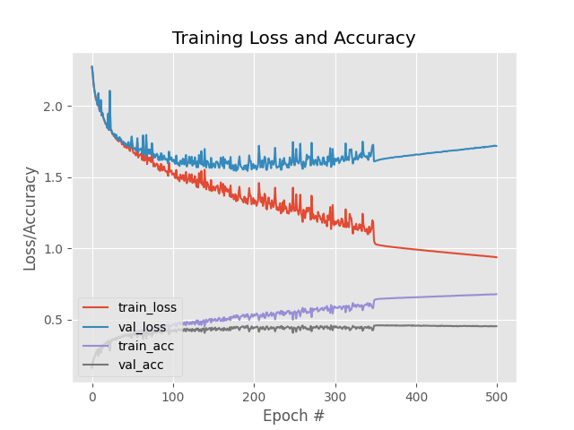

# Assignment 2 - Classification benchmarks with Logistic Regression and Neural Networks

## Original Assignment Description

For this assignment, we'll be writing scripts which classify the ```Cifar10``` dataset.

You should write code which does the following:

- Load the Cifar10 dataset
- Preprocess the data (e.g. greyscale, reshape)
- Train a classifier on the data
- Save a classification report

You should write one script which does this for a logistic regression classifier **and** one which does it for a neural network classifier. In both cases, you should use the machine learning tools available via ```scikit-learn```.

### Tips

- You should structure your project by having scripts saved in a folder called ```src```, and have a folder called ```out``` where you save the classification reports.
- Consider using some of the things we've seen in class, such as virtual environments and setup scripts.

### Purpose

- To ensure that you can use ```scikit-learn``` to build simple benchmark classifiers on image classification data
- To demonstrate that you can build reproducible pipelines for machine learning projects
- To make sure that you can structure repos appropriately

# Assignment 2 - Luke Ring (202009983)

## Contribution

The code for this assignment was written independently and is my own (Luke Ring, 202009983) [zeyus @ github](https://github.com/zeyus).

## Setup

### Prerequisites

- Python 3.9+

### Python modules

Install requirements.

```bash
pip install -r requirements.txt
```

## Data

The data is downloaded from the [Cifar10](https://www.cs.toronto.edu/~kriz/cifar.html) website and saved to `data/` by default, unless the `--no-download` flag is passed to the script.

## Usage

The script can be run from the command line.

```bash
python src/cifar10classifier.py
```

Options can be specified for the script, details can be found by running

```bash
python src/cifar10classifier.py --help
```

Output:

```txt
usage: cifar10classifier.py [-h] [--version] [-m MODEL_SAVE_PATH] [--no-download] [--force] [-d DATASET_PATH] [-b BATCH_SIZE] [-e EPOCHS] [-n] [-o OUT]

Text classification CLI

optional arguments:
  -h, --help            show this help message and exit
  --version             show program's version number and exit
  -m MODEL_SAVE_PATH, --model-save-path MODEL_SAVE_PATH
                        Path to save the trained model(s) (default: models)
  --no-download         Do not attempt to download the CIFAR10 dataset (default: False)
  --force               Force download of the CIFAR10 dataset (default: False)
  -d DATASET_PATH, --dataset-path DATASET_PATH
                        Path to the dataset (default: data)
  -b BATCH_SIZE, --batch-size BATCH_SIZE
                        The batch size (default: 256)
  -e EPOCHS, --epochs EPOCHS
                        The number of epochs (default: 150)
  -n, --neural-network  Use a neural network model, otherwise use logistic regression (default: False)
  -o OUT, --out OUT     The output path for the plots and stats (default: out)
```

## Results

The results of the script are saved to the `out` folder.

The script was run with the following arguments

```bash
python src/cifar10classifier.py -b 256 -e 500 -n
```

Output:

```txt
              precision    recall  f1-score   support

    airplane       0.51      0.51      0.51      1000
  automobile       0.53      0.51      0.52      1000
        bird       0.35      0.35      0.35      1000
         cat       0.30      0.28      0.29      1000
        deer       0.39      0.38      0.39      1000
         dog       0.39      0.39      0.39      1000
        frog       0.48      0.51      0.49      1000
       horse       0.53      0.54      0.53      1000
        ship       0.54      0.56      0.55      1000
       truck       0.50      0.53      0.51      1000

    accuracy                           0.46     10000
   macro avg       0.45      0.46      0.45     10000
weighted avg       0.45      0.46      0.45     10000
```



As can be seen, the payoff from training for more epochs is not always worth it. The neural network model was trained for 500 epochs, but the accuraccy and loss did not improve much after around 150 epochs.

For comparison, an Logistic Regression model was also trained for 500 epochs with the following results:

```txt
              precision    recall  f1-score   support

    airplane       0.34      0.37      0.36      1000
  automobile       0.33      0.35      0.34      1000
        bird       0.23      0.20      0.21      1000
         cat       0.20      0.16      0.18      1000
        deer       0.22      0.19      0.20      1000
         dog       0.27      0.27      0.27      1000
        frog       0.26      0.28      0.27      1000
       horse       0.28      0.27      0.28      1000
        ship       0.34      0.39      0.36      1000
       truck       0.37      0.42      0.39      1000

    accuracy                           0.29     10000
   macro avg       0.28      0.29      0.29     10000
weighted avg       0.28      0.29      0.29     10000
```

While the neural network model performed much better, neither had a very high F1 score. It's possible that a more complex neural network model would perform better, although just increasing the hidden layer sizes of the MLPClassifier did not significantly increase the model's performance, most likely due to overfitting.

