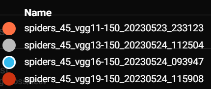

# Assignment 4 - Fine tuned VGG CNN Comparison

## Contribution

The code for this assignment was written independently and is my own (Luke Ring, 202009983) [zeyus @ github](https://github.com/zeyus).

## Description

This assignment is the final, self assigned project for the Cultural Data Science, Visual Analytics course at Aarhus University.

This project compares the classification performance of VGG networks fine tuned on the [YIKES! Spiders](https://www.kaggle.com/datasets/gpiosenka/yikes-spiders-15-species) dataset. This was of particular interest to me because there are many species of insects in general, and identifying species is difficult for untrained eyes. A recent article from phys.org describes over 100 new species of insects found in Norway alone in 2022 ([https://phys.org/news/2023-02-species-insects-norway.html](https://phys.org/news/2023-02-species-insects-norway.html)). This is a great example of how machine learning can be used to help identify species, and possibly adapted to identify new species from photos. Further potential applications could be for identifying harmless vs dangerous species in an application, and providing educational information about a particular insect. Although there are larger datasets with insects, the ones that I found that were available for use only contained labels for the insect family, not the species. This dataset was chosen because it contains labels for the species.

The dataset contains 2186 training images with 75 test images and 75 validation images with 15 different spider species. This project uses PyTorch, as opposed to the previous assignments that used TensorFlow. This was try implementing a neural network using a different framework.

## Setup

## Prerequisites

- Python 3.11

## Python modules

Install requirements.

```bash
pip install -r requirements.txt
```

## Data

Download the data from [https://www.kaggle.com/datasets/gpiosenka/yikes-spiders-15-species](https://www.kaggle.com/datasets/gpiosenka/yikes-spiders-15-species) and extract it to `data/`.

## Usage

The script can be run from the command line.

```bash
python src/eek.py
```

Options can be specified for the script, details can be found by running

```bash
python src/eek.py --help
```

Output:

```txt
usage: eek.py [-h] [--version] [-m MODEL_SAVE_PATH] [-o OUTPUT_PATH] [--download] [-d DATASET_PATH] [-e EPOCHS] [-n NET_NAME] [-b BATCH_SIZE] [-t] [-w WEIGHTS] [-V] [-i IMAGE_PATH] [-r ROTATION]

Text classification CLI

options:
  -h, --help            show this help message and exit
  --version             show program's version number and exit
  -m MODEL_SAVE_PATH, --model-save-path MODEL_SAVE_PATH
                        Path to save the trained model(s) (default: models)
  -o OUTPUT_PATH, --output-path OUTPUT_PATH
                        Path to save the output, figures, stats, etc. (default: out)
  --download            Download the dataset from kaggle (default: False)
  -d DATASET_PATH, --dataset-path DATASET_PATH
                        Path to the dataset (default: data)
  -e EPOCHS, --epochs EPOCHS
                        Number of epochs (default: 100)
  -n NET_NAME, --net-name NET_NAME
                        Name of the network to use (e.g. vgg19) (default: vgg19)
  -b BATCH_SIZE, --batch-size BATCH_SIZE
                        Batch size (default: 32)
  -t, --test-best-models
                        Test the best models (default: False)
  -w WEIGHTS, --weights WEIGHTS
                        Path to the weights file (.pth) (default: None)
  -V, --visualize       Visualize the model (activation maximization) (default: False)
  -i IMAGE_PATH, --image-path IMAGE_PATH
                        Predict the class for a single input image (default: None)
  -r ROTATION, --rotation ROTATION
                        Random rotation angle (degrees) for the input image (default: 90)
```

The weights from the best model for any run is saved in the `models` (or `MODEL_SAVE_PATH`) directory as a `.pth`file.

#### Reporting

Additionally, this script makes use of tensorboard (installed with the requirements), which allows monitoring of the script's progress. To use tensorboard, run the following command in the root directory of the project in a different shell instance:

```bash
tensorboard --logdir=out/runs
```

This provides a nice UI for the training progress and allows comparison between different training runs.

## Results

Although many different parameters were tried during the training and configuration, the final models used the following options:

- Epochs: 100
- Batch size: 150
- Training image random rotation angle: 45 degrees

The models used the AdamW optimizer with a learning rate of 0.001, and the CrossEntropyLoss function. The models were trained on a NVIDIA GeForce GTX 1070 GPU.

The training was invoked using the following command:

```bash
python ./src/eek.py -e 100 -n <vggnet> -b 150 -r 45
```

Where `<vggnet>` is the name of the VGG network to use. The following networks were used:
- vgg11
- vgg13
- vgg16
- vgg19

Subsequently, the best model of each network was run against the test set using the following command:

```bash
python ./src/eek.py -t
```

### Training

The training results for each network can be seen in the following figures:

Model Legend:




Validation Accuracy


Validation Loss


Interestingly enough, most models are extremely good even after the first epoch, and gains from further training are minimal. The vgg11 model seems to be the best performing model, with the highest validation accuracy and lowest validation loss.

### Testing

On the test data the models performed as follows:

| Model | Accuracy | Loss |
| --- | --- | --- |
| vgg11 | 0.9467 | 0.5871 |
| vgg13 | 0.9067 | 0.4135 |
| vgg16 | 0.9067 | 0.5502 |
| vgg19 | 0.9067 | 0.3621 |

The vgg11 model performed the best on the test data as well, with an accuracy of 0.9467 and a loss of 0.5871. The vgg13, vgg16 and vgg19 models all performed similarly, with an accuracy of 0.9067 and a loss of 0.4135, 0.5502 and 0.3621 respectively.

### Visualizing the model

The following images show the activation maximization of the vgg11 model for the different classes. The images were generated using the following command:

```bash
python ./src/eek.py -V -w <best_model_path> -n <model> -r <rotation>
```

Where `<best_model_path>` is the path to the best model weights, `<model>` is the name of the model to use, and `<rotation>` is the random rotation angle to use for the input image.

Some examples were generated for the vgg16 model and can be seen here:

Black widow:


Ladybird mimic spider:


## Conclusion

While the models all performed extremely well with limited training, a larger dataset would definitely improve the ability to classify spiders, especially as many look quite similar and only have minor differences between species. Additionally, the random rotation was important in ensuring a high classification accuracy, without it, the models overfit the training data very quickly. Using vgg networks as a base for insect classification seems promising, and could be further improved by using a larger dataset and more training time.